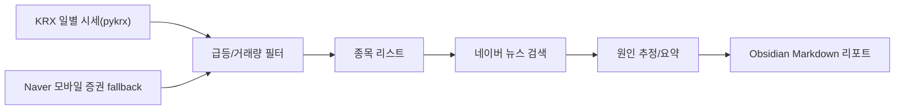

# System Design

## 구현 형태

초기 버전은 Python CLI와 Obsidian Markdown 저장 방식으로 만든다.

- 사용자 인터페이스: Python CLI
- 시세 데이터: `pykrx` 우선, 실패 시 Naver 모바일 증권 시세 fallback
- 뉴스 데이터: 네이버 뉴스 검색 API
- 아카이브: Obsidian Markdown 파일
- 저장 방식: `Obsidian-Archive/Market-Reports/YYYY/MM/*.md`
- 장점: 구현이 빠르고, 결과물이 Obsidian에서 검색/링크/태그로 관리된다.

## 데이터 흐름

## Obsidian 기록 규칙

- 회의/대화 원문은 `00_Inbox`
- 정제된 요구사항은 `01_Project`
- 설계는 `02_Design`
- 구현 중 알게 된 내용은 `03_Dev-Log`
- 되돌리기 어려운 선택은 `04_Decisions`
- 일별 장마감 리포트는 `Market-Reports`

## 선별 기준

- 상한가 추정: 등락률 `>= 29.5%`
- 급등: 등락률 `>= 12%`
- 거래량 급증: 거래량 `>= 10,000,000주`
- 최소 거래대금: 거래대금 `>= 5,000,000,000원`

현재 구현은 최소 거래대금 조건을 필수 필터로 사용한다. 즉 상한가, 12% 이상 상승, 거래량 1,000만 주 이상 중 하나에 해당하더라도 거래대금이 50억 원 미만이면 리포트에서 제외한다.

## 운영 주기

- 평일 장마감 이후 16:10 이후 실행 권장
- 데이터 반영이 늦는 날을 고려하면 16:30 실행이 더 안정적이다.
